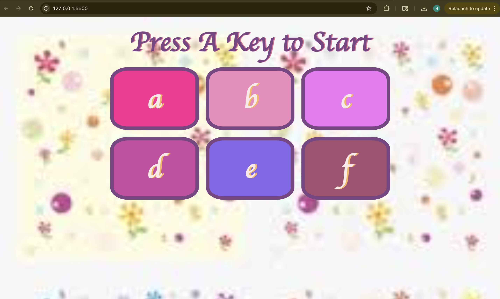
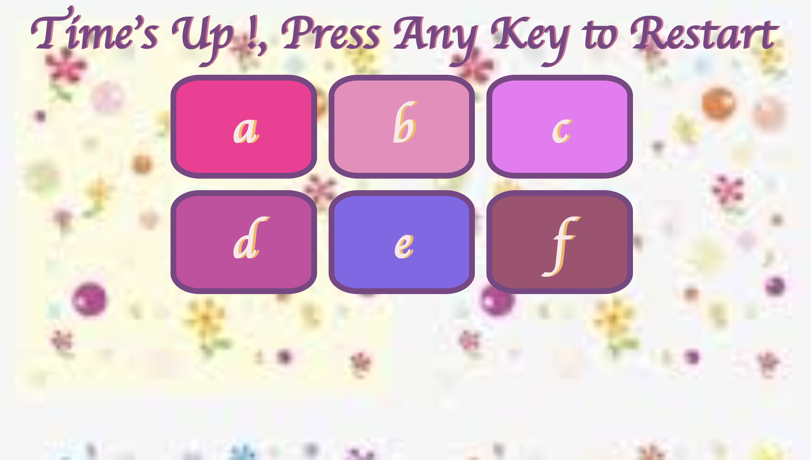
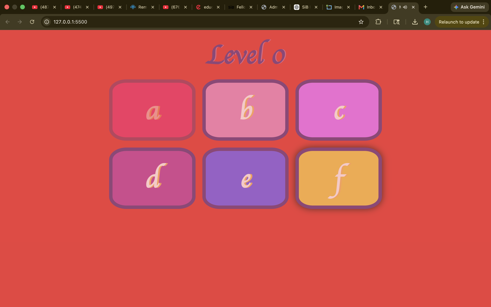

# 🧠 Master Pattern

Master Pattern is an interactive cognitive learning game inspired by the classic Simon Game. It was redesigned to overcome some limitations of traditional implementations by introducing educational, accessibility, and engagement-focused features for children.

---

## 🎯 Motivation

Most Simon-style games:

- Replay the entire sequence at the beginning of every round.
- Have no response time constraints.
- Rely solely on visual color cues.
- Primarily focus on entertainment.

Master Pattern aims to provide a more engaging and educational experience by encouraging memory retention, alphabet recognition, and multisensory learning.

---

## ✨ Features

### 🔤 Alphabet-Based Gameplay

Instead of colored pie segments, the game uses alphabetic symbols (`A-F`) to help children familiarize themselves with letters.

### 🔊 Voice-Assisted Learning

Each box has an associated voiceover.

Clicking or selecting a box plays its pronunciation, allowing children to rely on auditory cues in addition to visual cues.

### 🧠 Incremental Memory Training

Unlike traditional Simon games, the entire sequence is **not replayed** at the start of every level.

Only the newly added symbol is shown.

Players must remember previously learned symbols independently.

Example:

Level 1

```text
Shows: A
Input: A
```

Level 2

```text
Shows: C
Input: A C
```

Level 3

```text
Shows: F
Input: A C F
```

---

# 📸 Screenshots

### 🏠 Start Screen

<p align="center">
  
</p>

_Press any key to begin the game._

---

### ⏳ Time Expired

<p align="center">
  
</p>

_The game ends if the player fails to respond before the timer expires._

---

### ❌ Wrong Move

<p align="center">
  
</p>

_An incorrect sequence immediately ends the game and allows the player to restart._

### ⏳ Adaptive Time Constraints

Players are given a limited time to respond.

Response time increases gradually with level progression while being capped to maintain challenge.

### ⌨️ Multi-Platform Support

Supports:

- Mouse clicks
- Laptop keyboards
- Mobile touch interactions

making the game accessible across multiple devices.

### 🎨 Child-Friendly Design

Features:

- Soft pastel color palette
- Animations
- Audio feedback
- Responsive interface

---

## 🛠 Technologies Used

- HTML5
- CSS3
- JavaScript
- jQuery

---

## 📂 Project Structure

```text
MasterPattern/
│
├── screenshots/
│   ├── start-screen.png
│   ├── timeout-screen.png
│   └── wrong-move-screen.png
│
├── images/
│   └── bk4.jpeg
│
├── sounds/
│   ├── a.mp3
│   ├── b.mp3
│   ├── c.mp3
│   ├── d.mp3
│   ├── e.mp3
│   ├── f.mp3
│   ├── timeout.mp3
│   └── wrong.mp3
│
├── game.js
├── styles.css
├── index.html
└── README.md
```

---

## 🚀 How to Run

Clone the repository

```bash
git clone https://github.com/Hadiya-Mushtaq/MasterPattern.git
```

Move into the project directory

```bash
cd MasterPattern
```

Open

```text
index.html
```

in any modern browser.

---

## 🎮 How to Play

1. Press any key to start the game.
2. Observe the highlighted alphabet.
3. Repeat the sequence.
4. Use either:
   - Mouse clicks
   - Keyboard keys (A-F)
   - Touch input
5. Complete the sequence before the timer expires.
6. A wrong move or timeout ends the game.

---

## 💡 Key Improvements over Traditional Simon Games

| Traditional Simon        | Master Pattern                     |
| ------------------------ | ---------------------------------- |
| Color-based              | Alphabet-based                     |
| Visual-only cues         | Visual + Audio cues                |
| Unlimited response time  | Timed gameplay                     |
| Entire sequence replayed | Only new symbol displayed          |
| Entertainment-focused    | Educational and cognitive training |
| Desktop interaction      | Desktop + Mobile support           |

---

## 🔮 Future Enhancements

- Leaderboard system
- Adaptive timer based on age

---

## 👩‍💻 Author

**Hadiya Mushtaq**

B.Tech CSE, NIT Srinagar

_"Transforming memory games into engaging learning experiences for children through multisensory interaction."_
